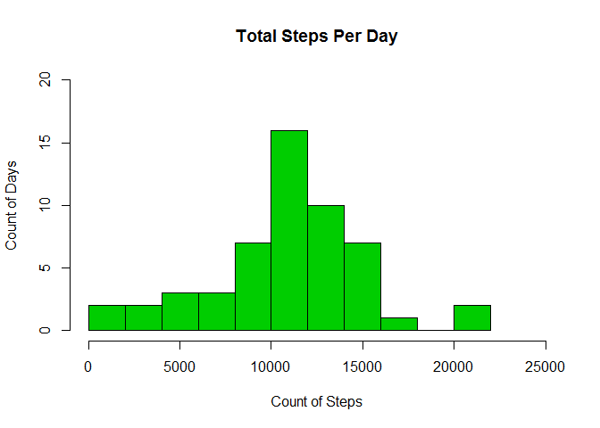
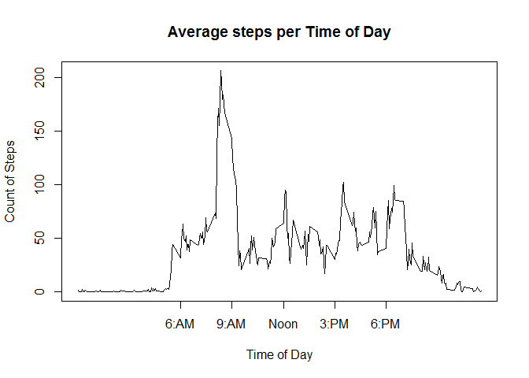
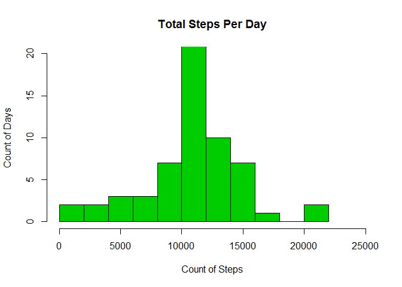
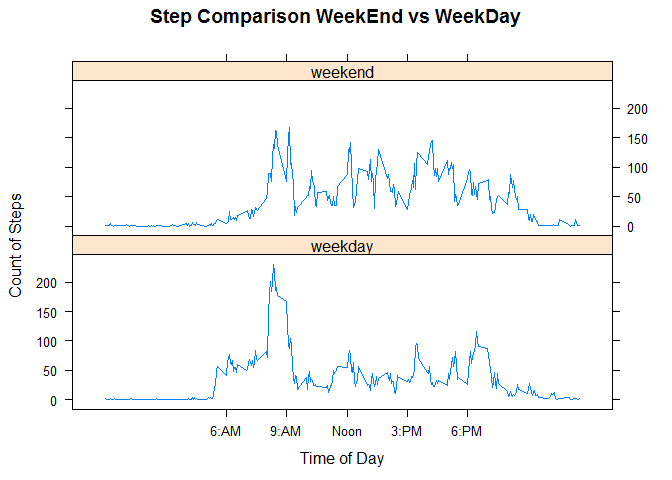

# Reproducible Research: Peer Assessment 1
Manny Ruiz  
October 22, 2017  


## Loading and preprocessing the data


```r
setwd("~/GIT_Public/RepData_PeerAssessment1")
data <- read.table(unz("activity.zip", "activity.csv"), nrows=17568, header=T, quote="\"", sep=",")
# Show the first few rows of the data set
head(data, 10 )
```

```
##    steps       date interval
## 1     NA 2012-10-01        0
## 2     NA 2012-10-01        5
## 3     NA 2012-10-01       10
## 4     NA 2012-10-01       15
## 5     NA 2012-10-01       20
## 6     NA 2012-10-01       25
## 7     NA 2012-10-01       30
## 8     NA 2012-10-01       35
## 9     NA 2012-10-01       40
## 10    NA 2012-10-01       45
```

```r
# For initial analysis lets remove na's from the dataset
clean_data <- data[complete.cases(data),]
```

## What is mean total number of steps taken per day?


```r
#Calculate and Display of total steps for first 10 days
StepsPerDay <- aggregate(steps ~ date, FUN=sum, data=clean_data)
head(StepsPerDay, 10)
```

```
##          date steps
## 1  2012-10-02   126
## 2  2012-10-03 11352
## 3  2012-10-04 12116
## 4  2012-10-05 13294
## 5  2012-10-06 15420
## 6  2012-10-07 11015
## 7  2012-10-09 12811
## 8  2012-10-10  9900
## 9  2012-10-11 10304
## 10 2012-10-12 17382
```


```r
#Histogram of Step Frequency
hist(StepsPerDay$steps, main="Total Steps Per Day", ylab="Count of Days", 
     xlab="Count of Steps", breaks=15, ylim=c(0,20), xlim=c(0,25000), col=3)
```

<!-- -->


```r
#Display a summary of stats
summary(StepsPerDay)
```

```
##          date        steps      
##  2012-10-02: 1   Min.   :   41  
##  2012-10-03: 1   1st Qu.: 8841  
##  2012-10-04: 1   Median :10765  
##  2012-10-05: 1   Mean   :10766  
##  2012-10-06: 1   3rd Qu.:13294  
##  2012-10-07: 1   Max.   :21194  
##  (Other)   :47
```

```r
#The summary function shows the mean steps per day is 10766 with a median of 10765
```


## What is the average daily activity pattern?

```r
# Aggregate and Display the Average number of steps by Interval
MeanStepsPerInterval <- aggregate(steps ~ interval, FUN=mean, data=clean_data)
head(MeanStepsPerInterval, 10)
```

```
##    interval     steps
## 1         0 1.7169811
## 2         5 0.3396226
## 3        10 0.1320755
## 4        15 0.1509434
## 5        20 0.0754717
## 6        25 2.0943396
## 7        30 0.5283019
## 8        35 0.8679245
## 9        40 0.0000000
## 10       45 1.4716981
```


```r
# Time Series Plot of Average Steps Taken
plot(MeanStepsPerInterval$interval, MeanStepsPerInterval$steps, type="l", xaxt = "n",
     xlab="Time of Day", ylab="Count of Steps", main="Average steps per Time of Day")
x <- c("6:AM","9:AM","Noon","3:PM","6:PM") 
axis(side=1, at=c(600,900,1200,1500,1800), labels=x)
```

<!-- -->


```r
# Calculate and Display the five minute interval that on average contains the max number of steps
MeanStepsPerInterval[which.max(MeanStepsPerInterval$steps),]
```

```
##     interval    steps
## 104      835 206.1698
```

```r
# The max filter shows the 8:35 AM interval has the max average steps with 206 
```
## Imputing missing values

```r
# Calculate and Display the number of na's in the DataSet
colSums(is.na(data))
```

```
##    steps     date interval 
##     2304        0        0
```

```r
# Results show the steps variable has 2,304 NA values
```

```r
# Make a copy of the orginga data set and replace null steps with average steps for that interval
dataI <-  data
dataI$steps <- ifelse(is.na(dataI$step) & 
                      dataI$interval == MeanStepsPerInterval$interval, 
               MeanStepsPerInterval$steps, dataI$steps)
```

```r
# Make sure our new imputed data set has no NA's
colSums(is.na(dataI))
```

```
##    steps     date interval 
##        0        0        0
```

```r
# Display the first few rows of the Imputed Dataset showing nulls have been replaced with interval mean
head(dataI, 10)
```

```
##        steps       date interval
## 1  1.7169811 2012-10-01        0
## 2  0.3396226 2012-10-01        5
## 3  0.1320755 2012-10-01       10
## 4  0.1509434 2012-10-01       15
## 5  0.0754717 2012-10-01       20
## 6  2.0943396 2012-10-01       25
## 7  0.5283019 2012-10-01       30
## 8  0.8679245 2012-10-01       35
## 9  0.0000000 2012-10-01       40
## 10 1.4716981 2012-10-01       45
```


```r
ImpStepsPerDay <- aggregate(steps ~ date, FUN=sum, data=dataI)
hist(ImpStepsPerDay$steps, main="Total Steps Per Day", ylab="Count of Days", 
     xlab="Count of Steps", breaks=15, ylim=c(0,20), xlim=c(0,25000), col=3)
```

<!-- -->


```r
#Display a summary of stats
summary(ImpStepsPerDay)
```

```
##          date        steps      
##  2012-10-01: 1   Min.   :   41  
##  2012-10-02: 1   1st Qu.: 9819  
##  2012-10-03: 1   Median :10766  
##  2012-10-04: 1   Mean   :10766  
##  2012-10-05: 1   3rd Qu.:12811  
##  2012-10-06: 1   Max.   :21194  
##  (Other)   :55
```

```r
#The summary function on on imputed data shows a slight increase in the median steps per date but the mean stays the same at 10766
```
## Are there differences in activity patterns between weekdays and weekends?

```r
# Add a variable to the dataset which indicates if the date is a weekend or weekday
dataI$DayGroup <- ifelse(grepl("S(at|un)", weekdays(as.Date(dataI$date))) == TRUE, 'weekend', 'weekday')
```

```r
# Create a Panel Plot Comparing WeekEnds and WeekDays
library(lattice)
dataIMean  <- aggregate(steps ~ DayGroup + interval, FUN=mean, data=dataI)
xnam <- c("6:AM","9:AM","Noon","3:PM","6:PM") 
xpos <- c(600,900,1200,1500,1800)
xyplot(steps ~ interval | DayGroup, dataIMean,layout=c(1,2), type="l",
       scales=list(x=list(at=xpos, labels=xnam)), ylab="Count of Steps" ,
       xlab="Time of Day", main="Step Comparison WeekEnd vs WeekDay")
```

<!-- -->

```r
# The comparison shows Weekends have a steady number of steps throughout the day.
# WeekDays have a spike in steps around 8:30am but diminish the rest of the day.
```

